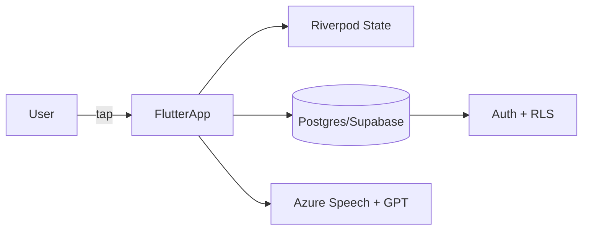

# Hi, I’m Jean Cecilia 👋

  

**Full-stack mobile/web developer** — Flutter • Supabase • Clean Architecture  
Bangkok-based 🇹🇭 • Entrepreneur • Legal/Business tech

---

### 🔧 What I build
- Mobile apps & web apps in **Flutter** (iOS / Android / Web)
- Backends on **Supabase** (PostgreSQL, RLS, functions), Firebase
- SaaS for non-technical teams: CRM, invoicing, edutravel, IoT dashboards
- Selected projects:
  - **Yim Noi** — video speed-dating app (Supabase, multi-lang)
  - **Nail House 168 Udon Thani** — local services & booking
  - **IoT** — Smart Plant Watering / Air Quality Monitor (TH market)
  - **Law-firm CRM** — Thai/English, PDF exports

---

### 🧩 Architecture snapshot

---

### 📊 Real GitHub Stats
<!-- The following SVGs query GitHub in real-time and reflect actual stats for @jeancecilia -->

---

### 🛠 Skills
| Area | Stack |
|---|---|
| Mobile | Flutter (Dart), Flutter Web |
| Backend/DB | Supabase, PostgreSQL, Firebase |
| Patterns | Clean Architecture, Riverpod |
| DevOps | GitHub Actions, CI/CD |
| Biz | CRM, invoicing, IoT, legal-tech |

---

### 🌐 Links
- Portfolio: https://kaizenkode.de
- Fiverr: https://www.fiverr.com/ (replace)
- LinkedIn: https://www.linkedin.com/in/ (replace)
- Email: you@example.com (replace)

<!--updated: 1970-01-01T00:00:00Z-->

> “Ship fast, iterate faster.” — my working style 🚀
