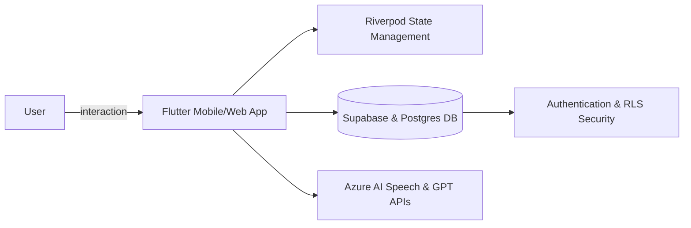

# Technical IT Project Manager & Product Leader 👋

**Agile Delivery • Full-Stack Technical Literacy • Flutter & Supabase Systems**  
Bangkok-based 🇹🇭 • Entrepreneur • Specializing in Legal, Business & IoT Systems

I bridge the gap between high-level business strategy, cross-functional stakeholders, and high-performance engineering teams. As a Technical IT Project Manager with a solid hands-on background in full-stack mobile and web engineering, I bring rare technical literacy to agile project coordination—ensuring products are shipped fast, architectures are clean, and legal/business requirements are met seamlessly.

---

### 📈 Real GitHub Stats (Live)

<!-- Stats Card with true numbers injected by GitHub Actions -->

<table>
<tr>
<td>

<strong>Total Commits</strong> 
<b><!--stat:commits-->1154<!--/stat:commits--></b>

</td><td>

<strong>Total PRs</strong> 
<b><!--stat:prs-->15<!--/stat:prs--></b>

</td><td>

<strong>Total Issues</strong> 
<b><!--stat:issues-->0<!--/stat:issues--></b>

</td><td>

<strong>Public Repos</strong> 
<b><!--stat:repos-->24<!--/stat:repos--></b>

</td>
</tr>
</table>

<table>
<tr>
<td>

<strong>Total Contributions (last 12 months)</strong> 
<b><!--stat:overall-->1181<!--/stat:overall--></b>

</td><td>

<strong>Current Streak</strong> 
<b>1 day</b>

</td><td>

<strong>Longest Streak</strong> 
<b>17 days</b>

</td>
</tr>
</table>

---

### 💼 What I Manage & Ship
I act as the technical backbone of projects, combining **Agile Project Management** and **High-Performance Coding** to deliver complex platforms:
- **Agile Scrum Master & Delivery:** Backlog refinement, standups, sprint planning, and coordinating technical roadmap execution.
- **Full-Stack Engineering Leadership:** Overseeing architectural design and building scalable frontends in **Flutter** and secure backends on **Supabase/PostgreSQL**.
- **Product Strategy & Lifecycle:** Delivering CRM systems, billing & invoicing platforms, legal-tech, and IoT dashboards for non-technical business teams.

- **Selected Managed/Delivered Projects:**
  - **Yim Noi** — Video speed-dating mobile application (Supabase, multi-lang localization).
  - **Law-Firm CRM** — Advanced customer management system with secure PDF exports and bilingual workflows.
  - **Nail House 168 Udon Thani** — Local services, booking engine, and staff management system.
  - **IoT Plant Care & Air Monitor** — Smart Plant Watering & Air Quality Monitor for the Thai market.

---

### 🧩 Architecture & Technical Strategy

```mermaid
flowchart LR
  User -->|interaction| FlutterApp[Flutter Mobile/Web App]
  FlutterApp --> Riverpod[Riverpod State Management]
  FlutterApp --> Supabase[(Supabase & Postgres DB)]
  Supabase --> Auth[Authentication & RLS Security]
  FlutterApp --> AI[Azure AI Speech & GPT APIs]
```

---

### 🛠 Skill Matrix & Badges

#### **IT Project Management & Delivery**

#### **Software Engineering & Databases**

#### **DevOps & Infrastructure**

---

### 🌐 Links
- LinkedIn: https://www.linkedin.com/in/hire-it-project-manager
- Email: info@appdevbangkok.com 
- Representing: https://devstackph.com/
- Representing: https://devstackph.com/
- Representing: https://appdevbangkok.com/

<!--updated: 2026-05-26T06:53:00Z-->

> “Ship fast, iterate faster.” — my working style 🚀
